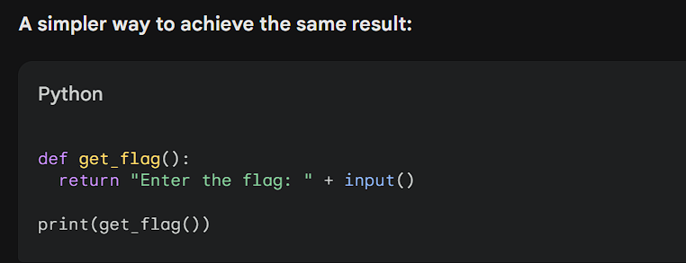

## Overview
- Challenge cho 1 file obfuscated python.
```
import sys

sys.setrecursionlimit(10000000)

(lambda _0: _0(input))(lambda _1: (lambda _2: _2('Enter the flag: '))(lambda _3: (lambda _4: _4(_1(_3)))(lambda _5: (lambda _6: _6(''.join))(lambda _7: (lambda _8: _8(lambda _9: _7((chr(ord(c) + 12) for c in _9))))(lambda _10: (lambda _11: _11(''.join))(lambda _12: (lambda _13: _13((chr(ord(c) - 3) for c in _10(_5))))(lambda _14: (lambda _15: _15(_12(_14)))(lambda _16: (lambda _17: _17(''.join))(lambda _18: (lambda _19: _19(lambda _20: _18((chr(123 ^ ord(c)) for c in _20))))(lambda _21: (lambda _22: _22(''.join))(lambda _23: (lambda _24: _24((_21(c) for c in _16)))(lambda _25: (lambda _26: _26(_23(_25)))(lambda _27: (lambda _28: _28('16_10_13_x_6t_4_1o_9_1j_7_9_1j_1o_3_6_c_1o_6r'))(lambda _29: (lambda _30: _30(''.join))(lambda _31: (lambda _32: _32((chr(int(c,36) + 10) for c in _29.split('_'))))(lambda _33: (lambda _34: _34(_31(_33)))(lambda _35: (lambda _36: _36(lambda _37: lambda _38: _37 == _38))(lambda _39: (lambda _40: _40(print))(lambda _41: (lambda _42: _42(_39))(lambda _43: (lambda _44: _44(_27))(lambda _45: (lambda _46: _46(_43(_45)))(lambda _47: (lambda _48: _48(_35))(lambda _49: (lambda _50: _50(_47(_49)))(lambda _51: (lambda _52: _52('Correct FLAG!'))(lambda _53: (lambda _54: _54('Incorrect'))(lambda _55: (lambda _56: _56(_41(_53 if _51 else _55)))(lambda _57: lambda _58: _58)))))))))))))))))))))))))))
```
- Bạn có thể tìm hiểu rõ hơn ở link: *https://github.com/gio54321/lambdifier*
## Solution
- Để giải quyết bài toán này, ta bắt buộc phân tích kĩ.
- Hàm lambda là 1 hàm vô danh, lấy ví dụ:
```
lambda x: x*x(5)
```
- Kết quả in ra là 25.
=> `lambda tham_so:  bieu_thuc`.
```
(lambda _0: _0(input))(
    lambda _1: (lambda _2: _2("Enter the flag: "))(
        lambda _3: (lambda _4: _4(_1(_3)))(
            ...
        )
    )
)
```

- Từ đoạn code trên, ta hiểu `lambda_1` định nghĩa `lambda_2` là biểu thức với parameter `lambda_3`.
=> ta đoán đc chương trình in ra `Enter the flag: ` rồi bắt nhập input.
- Qua đó, ta nhận ra `(_1(_3))` sẽ biến thành `input("Enter the flag: ")`, coi `_3` là `input()`.
- `lambda _4` biến đổi thành.
```
(lambda _0: _0(input))(
    lambda _1: (lambda _2: _2("Enter the flag: "))(
        lambda _3: (lambda _4: _4(input("Enter the flag: ")))(
            ...
        )
    )
)
```
- Tương tự, ta áp dụng tư duy để giải tiếp.
```
(lambda _6: _6("".join))(
    lambda _7: (
        lambda _8: _8(lambda _9: _7((chr(ord(c) + 12) for c in _9)))
    )(
        lambda _10: (lambda _11: _11("".join))(
            lambda _12: (
                lambda _13: _13((chr(ord(c) - 3) for c in _10(input("Enter the flag: "))))
            )(
                # ...
            )
        )
    )
)
```
```
    lambda _14: (lambda _15: _15(_12(_14)))(
    lambda _16: (lambda _17: _17(''.join))(
    lambda _18: (lambda _19: _19(lambda _20: _18((chr(123 ^ ord(c)) for c in _20))))(
    lambda _21: (lambda _22: _22(''.join))(
    lambda _23: (lambda _24: _24((_21(c) for c in _16)))(
    lambda _25: (lambda _26: _26(_23(_25)))(
    lambda _27: (lambda _28: _28('16_10_13_x_6t_4_1o_9_1j_7_9_1j_1o_3_6_c_1o_6r'))(
    lambda _29: (lambda _30: _30(''.join))(
    lambda _31: (lambda _32: _32((chr(int(c,36) + 10) for c in _29.split('_'))))
```
=> Tóm tắt lại chương trình:
```
flag = input("Enter the flag: ")
flag = "".join(chr(ord(c) + 12) for c in flag)
flag = "".join((chr(ord(c) - 3) for c in flag))
flag = "".join((chr(123 ^ ord(c)) for c in flag))
target = "".join((chr(int(c, 36) + 10) for c in "16_10_13_x_6t_4_1o_9_1j_7_9_1j_1o_3_6_c_1o_6r".split("_")))
```
- Cuối cùng, ta chỉ cần dịch ngược lại là xong:
```
enc_flag = "16_10_13_x_6t_4_1o_9_1j_7_9_1j_1o_3_6_c_1o_6r"
a = list(enc_flag.split("_"))
flag = "".join(chr(int(c, 36) + 10) for c in a)
flag = "".join(chr(123 ^ ord(c)) for c in flag)
flag = "".join((chr(ord(c) + 3) for c in flag))
flag = "".join(chr(ord(c) - 12) for c in flag)
print(flag)
```
=> FLAG: `FLAG{l4_1a_14mbd4}`